# Yap! — Contextual Pulse Messaging

[](https://kotlinlang.org)
[](https://developer.android.com/jetpack/compose)
[](https://firebase.google.com)
[](LICENSE)

**Yap!** is a high-speed communication tool designed for "impulsive context." The core philosophy is to minimize the friction between a thought and its delivery. Whether it's a reaction, a voice note, or a quick status update, Yap! ensures your pulse reaches your friends instantly.

 **Design:** [View in Figma](https://www.figma.com/design/TvTSzVBINBdonUKFd1Z253/Yap?node-id=0-1)

---

## 📸 Screenshots

### ⚡ Core Experience

<p align="center">
  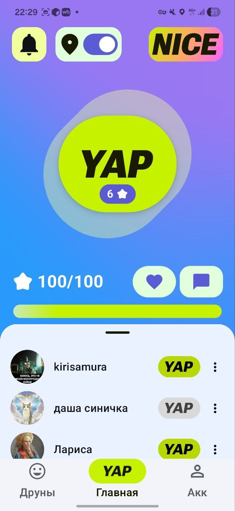
  
  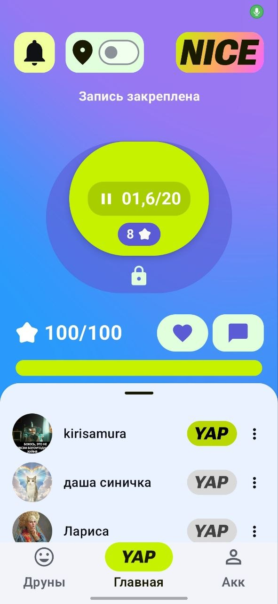
</p>

<p align="center">
  <i>Sub-second Yap delivery</i> • <i>Real-time activity feed</i> • <i>Hold-to-record interface</i>
</p>

### 👥 Social & Networking

<p align="center">
  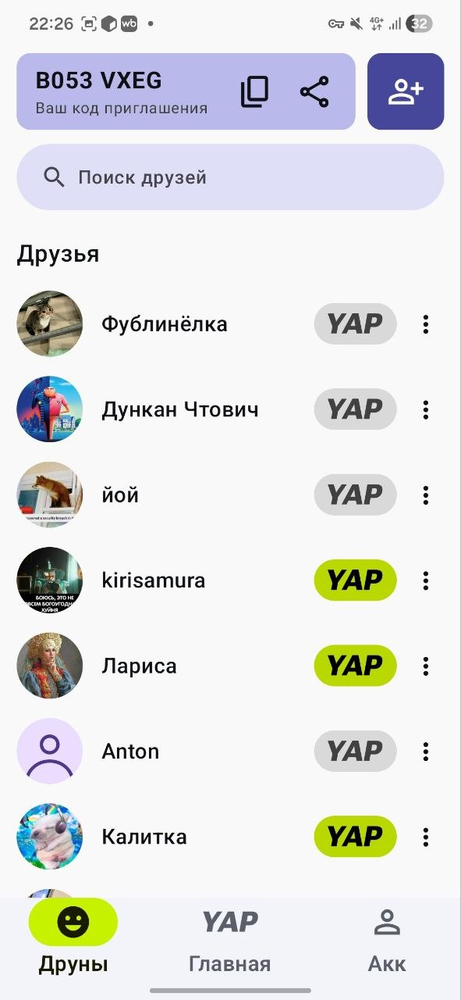
  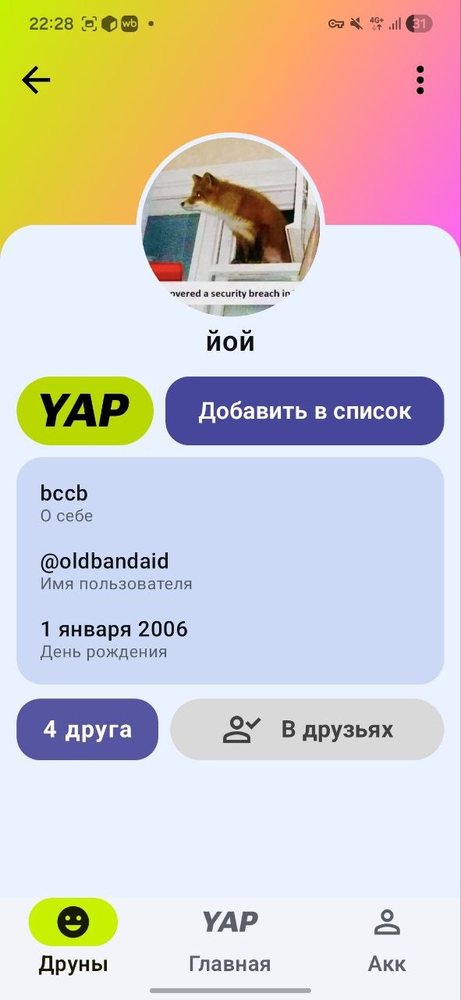
  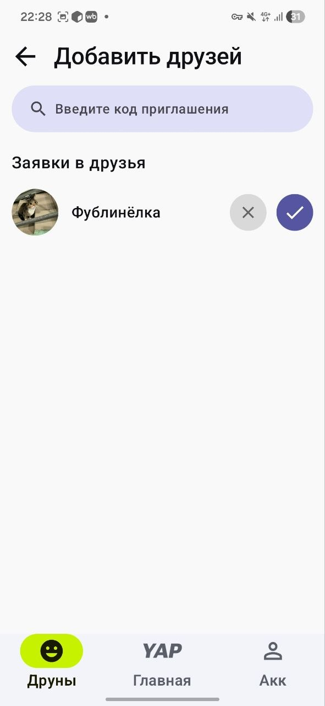
  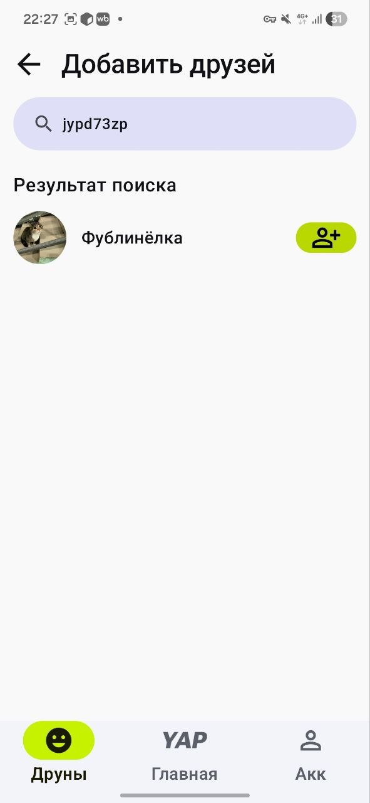
</p>

### 🛠 Interaction Details

<p align="center">
  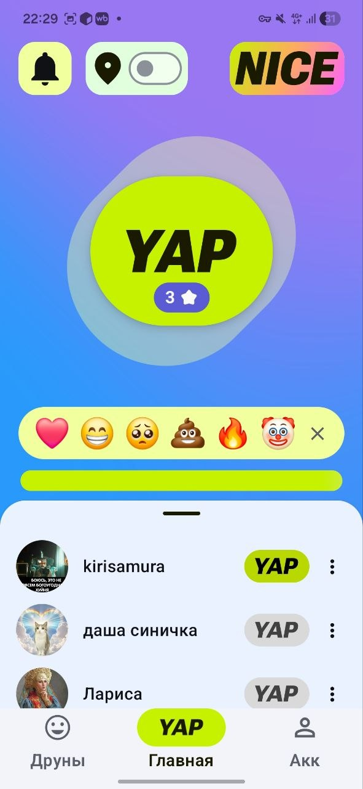
  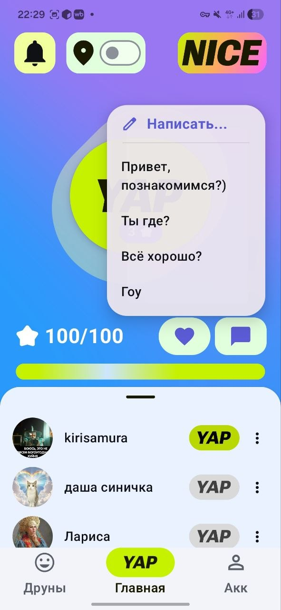
  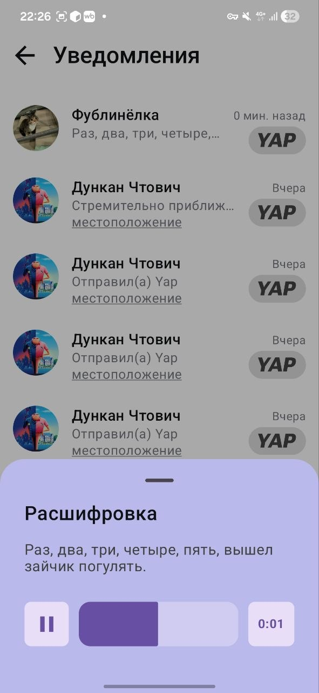
  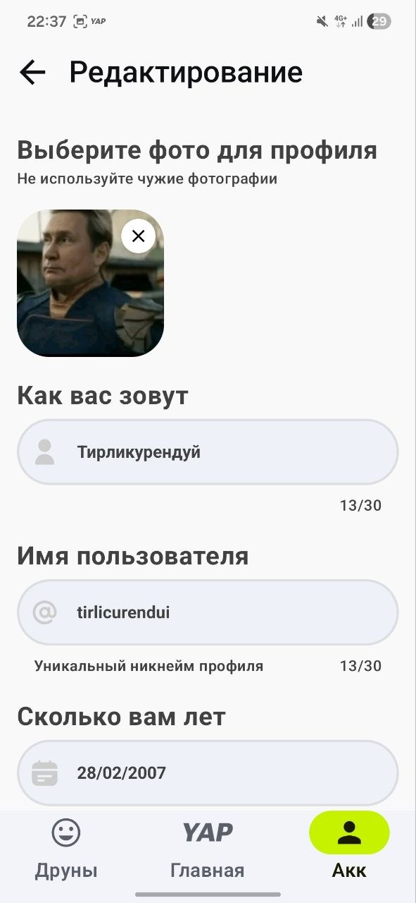
</p>

### 🔐 Entry Point

<p align="center">
  
  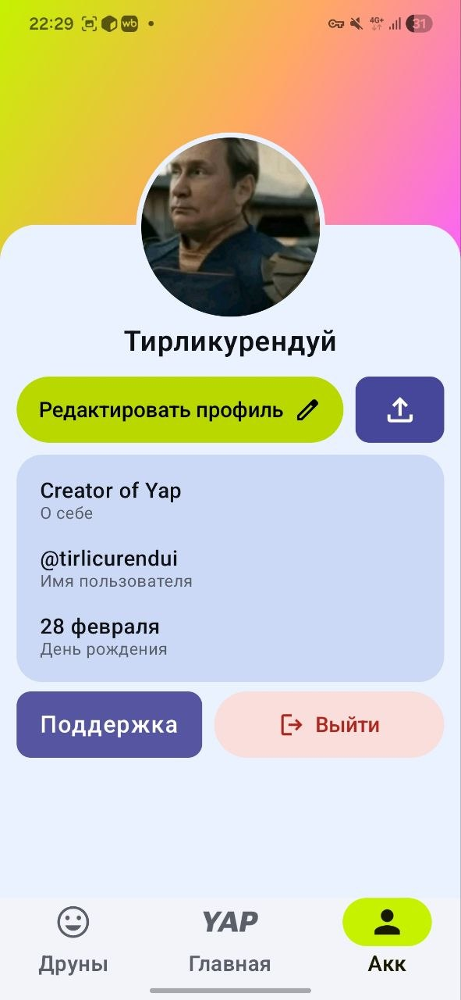
</p>

<p align="center">
  <i>Google One Tap Sign-In</i> • <i>User Dashboard</i>
</p>

---

# ✨ Key Features

## ⚡ The "Yap" Ecosystem

The heart of the app is the **Multi-functional Yap Button**. It supports complex interactions via intuitive gestures:

- **Instant Yap:** Send a default ping with a single tap.
- **Reaction & Presets:** Quick-access impulsive reactions and pre-defined messages.
- **Custom Text:** Send your own context on the fly.
- **Voice Yaps:** Hold to record voice messages with **automatic transcription** upon delivery.
- **Global Access:** Send Yaps from almost any screen within the app to never miss a moment.

### 🔔 Smart Notifications & Interaction

* **Custom Push Infrastructure:** Notifications are routed through a **dedicated backend server (hosted on Render)**. This bypasses generic Firebase mass-broadcasting, allowing for precise Point-to-Point (P2P) delivery.
* **Rich Context:** Notifications display the sender's identity and message content (Yaps or friend requests) immediately.
* **Deep Linking:** Fully implemented custom `FirebaseMessagingService` that parses `target_screen` data, allowing the app to navigate to the specific screen (e.g., Notifications or Friend requests) upon clicking the push.
* **Real-time Updates:** Powered by Firestore for sub-second synchronization.
* **Transcription:** AI-driven voice-to-text conversion for easy reading on the go.
* **User Control:** One-tap **Mute** or user removal for a noise-free experience.

## 👥 Social & Profile

- **Google Auth:** Seamless onboarding via Firebase Authentication and Google ID.
- **Unique Friend Codes:** Add friends via secure unique IDs.
- **Rich Profiles:** View avatars, bios, and birthdays. Share your profile via deep links.
- **Profile Management:** Fully editable personal profiles with cloud-synced storage.

---

# 🛠 Technical Stack

The app is built using modern Android development standards, focusing on a reactive and scalable architecture.

- **Architecture:** Clean Architecture with **MVVM** (Model-View-ViewModel).
- **UI Framework:** **Jetpack Compose** (100% declarative UI).
- **Concurrency:** **Kotlin Coroutines & Flow** for asynchronous, non-blocking data streams.
- **Networking:** **Ktor Client** & **Retrofit** for API communication.

## ☁️ Backend & Cloud

- **Firebase**
  - Authentication
  - Firestore (Real-time Database)
  - FCM (Custom Service Implementation)

- **Supabase**
  - Secondary storage
  - Scalable file management via `supabase-kt`
  
- **Custom Server (Render):** Node.js middleware for handling secure P2P push notifications.

## 💾 Persistence & Media

- **DataStore** for local preferences
- **Coil** for efficient image loading

## 📍 Location Services

- Google Play Services Location for high-accuracy contextual data

---

# 📦 Core Dependencies

```kotlin
dependencies {

    // UI & Compose
    implementation("androidx.compose.material3:material3:1.3.0")
    implementation("io.coil-kt:coil-compose:2.5.0")
    implementation("androidx.core:core-splashscreen:1.0.1")

    // Backend: Firebase
    implementation(platform("com.google.firebase:firebase-bom:34.12.0"))
    implementation("com.google.firebase:firebase-firestore")
    implementation("com.google.firebase:firebase-auth")
    implementation("com.google.firebase:firebase-storage")
    implementation("com.google.firebase:firebase-messaging:25.0.1")

    // Backend: Supabase & Ktor
    implementation(platform("io.github.jan-tennert.supabase:bom:3.5.0"))
    implementation("io.github.jan-tennert.supabase:storage-kt")
    implementation("io.ktor:ktor-client-android:3.0.0")

    // Auth & Identity
    implementation("androidx.credentials:credentials:1.2.2")
    implementation("com.google.android.libraries.identity.googleid:googleid:1.1.1")
}
```

---

# 🚀 Getting Started

## 1. Clone the Repository

```bash
git clone https://github.com/ManuScript07/Yap.git
```

## 2. Firebase Setup

1. Create a project in the Firebase Console
2. Add `google-services.json` to the `app/` directory
3. Enable:
   - Google Authentication
   - Firestore Database
   - Remote config

## 3. Supabase Setup

Initialize a Supabase project and add your credentials to the app configuration.

## 4. Build & Run

Run the project using **Android Studio Jellyfish** or newer.

---

# ⚖️ License

This project is licensed under the NCOSL License — see the [LICENSE](https://github.com/ManuScript07/Yap/blob/main/LICENSE) file for details.
